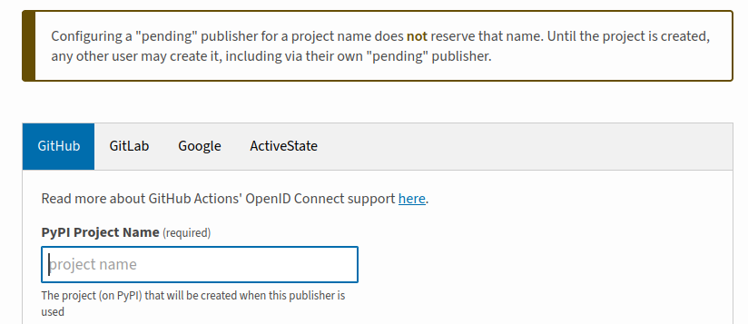
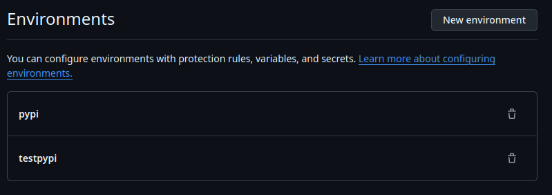

# PyPI Setup to use with GitHub Actions (without using PyPI token)
[](https://coveralls.io/github/shubhra-gadhwala/pypi-test-project?branch=main)
## PyPI Account Setup
1. Create a PyPI account in [https://test.pypi.org/](https://test.pypi.org/) for test and the [https://pypi.org/](https://pypi.org/) for production.
2. Set MFA for the account (required for pushing to PyPI).
3. Goto [https://test.pypi.org/manage/account/publishing/](https://test.pypi.org/manage/account/publishing/) and **Add a new pending publisher**.
4. Set the **PyPI Project Name** to the one set in the `setup.cfg` file.

    

    - If the name is already taken, than you would need a new name for the project. Create a new name and update the same in the `setup.cfg` file.

        ```
        [metadata]
        name = <new-project-name>
        ```
5. Fill in the rest of the details and click on **Add** button.
6. Same steps need to be followed for the production PyPI account.

---

## Github Project Setup
1. Create and configure stage and production environments in the github projects:

    
2. Create a new workflow file in the `.github/workflows` directory.
    - Please refer the sample github workflow file provided.
3. The sample workflow has the following steps:
    - Prepare job: Runs static analysis, builds package distribution files
    - Test job: Runs tests on multiple Python versions and platforms
    - Finalize job: Aggregates test coverage reports
        - Uses `coveralls` to create and aggregate the test coverage reports. Needs the repository to be public.
        - Viewable on `https://coveralls.io/github/{YOUR_USERNAME}/{YOUR_GITHUB_PROJECT_NAME}`
    - Publish job: Deploys to PyPI on version tags (e.g. v1.0.0)
    - Publish-test job: Deploys to TestPyPI on pre-release tags (e.g. v1.0.0-alpha)
4. The workflow is configured to run on `main` branch and on version tags (e.g. v1.0.0).
    - Which means when a new release is created along with a tag on GitHub UI, the workflow will automatically deploy the package to PyPI and TestPyPI.
